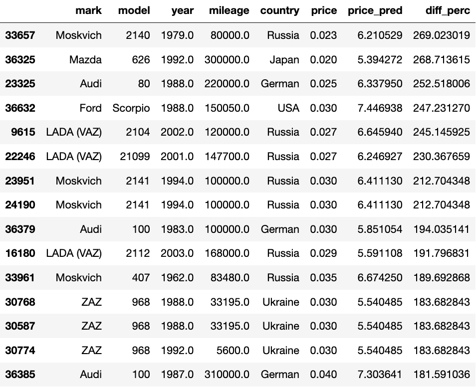

## Homeworks for ITMO course "ML for scientific data analysis" (feb 2024)

_Study project to work with some new (for me) python packages and to improve some data analysis and data processing skills._

Data was taken [from kaggle](https://www.kaggle.com/datasets/beaver68/cars-dataset-in-russia): _Dataset of cars in Russia_

**Task:** to predict cars price based on their characteristics

Python version: `3.8.10`\
Requirements: `requirements.txt`

### Homework 1

Location: `hw01-eda&baseline/`

1. EDA was conducted (`eda.ipynb`)
2. Some models were tried as a baseline (`baseline.ipynb`)
  - `DummyRegressor`
    - predicts median (by dataset) of price value for every input
    - `MAE~1.00` which means that by average model prediction is wrong by `1m RUB`! 
  - `RandomForestRegressor`
    - `MAE~0.262` which means that by average model prediction is wrong by `260k RUB`!</li>

### Homework 2

Location: `hw02-project/`

1. Hyperparameters optimization of `RandomForest` with `optuna` (`optuned-forest.ipynb`)
  - cross validation was too _expensive_ to use during the `RandomForest` optimization process: 50 trials (without `cross_validate`) takes ~2h on CPU, results of trials were saved in `optuna/01_randomforest_optuna_res.csv`
  - _best regressor_ has resulted in `MAE~0.245` which is a bit better in contrast to the first try with `RandomForest`
  - _feature importance_ analysis showed, that the most important featuresfor `price` prediction are (by descending of importance): `torque`, `year`, `transmissions` and `mileage`
2. On the next step of the study `CatBoost` package was tried (`catboost.ipynb`) since the `RandomForest` optimization did not give tangible results
  - the library turned out to be quite easy to use: all we need (for a quick start) is to specify `iterations`, `loss_function` and `cat_features` parameters for `CatBoostRegressor`
  - `MAE~0.182` which is on `52%` better than the `RandomForest` result
  - I have tried to train regressor on cars that costs less than some `threshold` (in order not to take into account very expensive cars, which number was too low in the dataset), but despite the fact that MAE was falling, MAPE remained at the same level (`~16%`)
  - _feature importance_ analysis showed, that the most important featuresfor `price` prediction are (by descending of importance): `mileage`, `torque`, `year` and `consumption`
3. Neural Network with `pytorch` (see `pytorch.ipynb`)
  - best metrics that was reached for NN is `0.189`, which is badder than for `CatBoost`
  - `shap` library was tried but it turned out that it can be used only for classification tasks visualisation (???)

#### Results

Both models (`RandomFOrestRegressor` and `CatBoostRegressor`) have choosed quite logic (according to life experience) features to predict the `price` of cars. But _in my opinion_ the `CatBoost` model's top-3 important features look more believable. Also `CatBoost` model resulted in a better target metrics value (`MAE~0.182` or `MAPE~16%`, which means that average prediction distincts by 16% from the true value) which makes it the winner (among all tried models) for that task.

`TODO 1` Unfortunely, I had no time to try other models (for example simple _fully-connected neural network_) and I focused on `CatBoost`, which I never used before.

`TODO 2` Also I wanted to try some _unsupervised_ solutions to clasterise the data and to obtain (for example) `country`-clustered dataset. Maybe I'll try it in another tasks:)

**UPDATE (23.02.2024):** I have tried neural network to solve the task. The result was badder (or ~ same) than for `CatBoostRegressor`!

#### `P.S.` Top cars to buy :laughing:

_According to `CatBoostRegressor` model_

